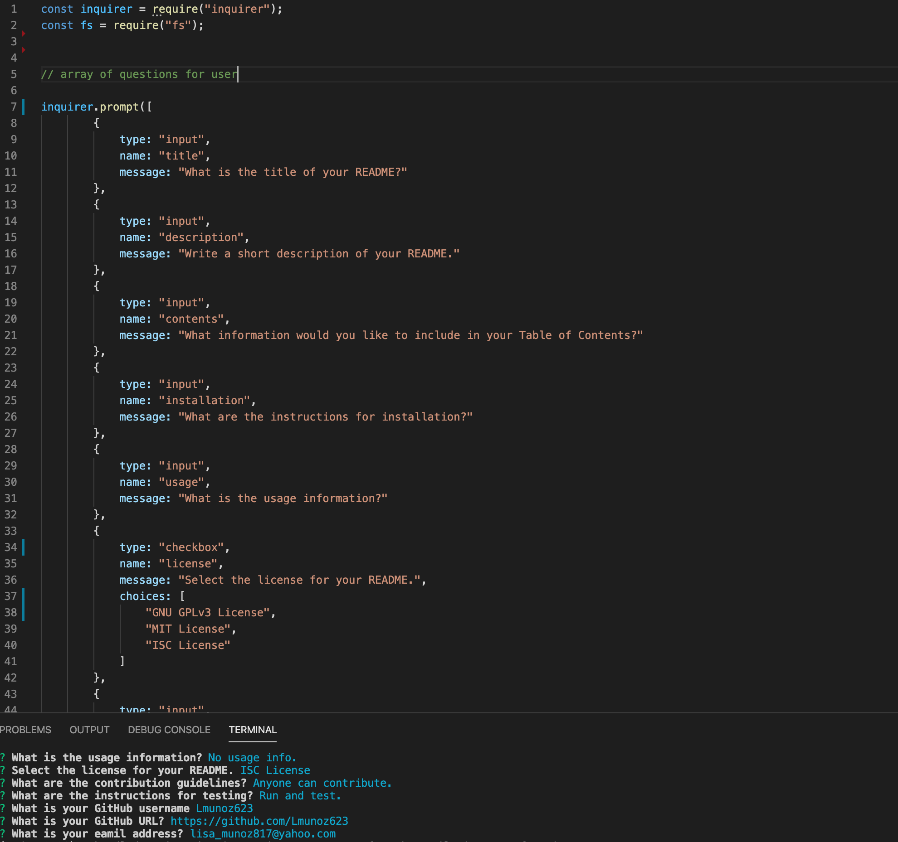

# hw-8-readme-generator
A README generated that will create a professional README generator for a new project.

## Summary
This homework assignment was to use node to creade a README generator. The questions were prompted to the terminal and the answers would rendera completed README.md file.

 
